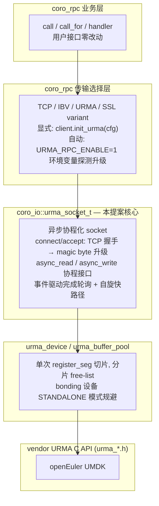

# URMA 传输层接入 yalantinglibs 提案

> 状态：提案 (Proposal)
> 作者：yalantinglibs 社区贡献者
> 关联分支：`supercache_dev_zjw2`

## 一、背景与动机

`coro_rpc` 目前支持 TCP、IBV(RDMA)、SSL、NTLS 四种传输。对于部署在 openEuler + UB（Unified Bus，灵衢总线）硬件上的数据中心场景，这些传输无法直接利用 UB 的内存语义互联（低延迟、高带宽、硬件原生远程内存访问）。

[URMA](https://gitee.com/openeuler/umdk)（Unified Remote Memory Access）是 openEuler UMDK 提供的用户态通信库，基于 UB/UBoE 硬件，向上提供统一的 Jetty（收发端点）+ JFC（完成队列）+ Segment（注册内存）抽象，支持两侧 send/recv、单边 read/write 与原子操作。

本提案的目标：**将 URMA 作为 coro_rpc 的一等传输接入 yalantinglibs**，让上层 RPC 用户在不改动业务代码的前提下，通过环境变量即可把 TCP 升级为 URMA，获得 UB 硬件的低延迟与高吞吐收益。

## 二、架构设计

### 2.1 分层结构

### 2.2 核心组件职责

| 组件 | 职责 |
|------|------|
| `urma_socket_t` | 对外异步 socket，实现与 `asio::tcp::socket` 一致的协程接口；负责 TCP 握手、Jetty 建链、收发窗口流控 |
| `urma_device` / `urma_device_manager` | 封装设备枚举、context 创建、bonding 模式设置；单例复用同一设备 |
| `urma_buffer_pool_t` | 一次性注册大段内存再切片，避免逐 4KB `register_seg`；64 路分片 free-list 降低竞争 |
| `urma_rpc_env` | 环境变量自动使能：探测设备可用性，返回 `optional<config_t>`，探测失败静默回退 TCP |

### 2.3 接入方式

编译开关 `YLT_ENABLE_URMA=ON`，运行期两种启用方式：

1. **显式 API**：`client.init_urma(cfg)` / `server.init_urma(cfg)`，适合需要精细配置的场景。
2. **环境变量自动升级**（推荐）：设置 `URMA_RPC_ENABLE=1`，coro_rpc 在默认 TCP 配置下自动探测设备并升级；显式选择 IBV/SSL/URMA 时不覆盖。探测失败自动回退 TCP，**不抛异常、不影响可构造性**。

服务端复用现有 TCP listener，通过首字节 magic number 嗅探（与 IBV 升级路径同构）触发 `update_to_urma()`，无需单独端口。

## 三、关键设计决策

1. **TCP 握手 + magic byte 升级**：URMA 复用 coro_rpc 现有 TCP listener，连接建立后通过首字节嗅探升级到 URMA，与 IBV/RDMA 升级路径同构，不引入额外端口与监听线程。
2. **事件驱动完成轮询 + 自旋快路径**：基于 JFCE event fd 的事件循环，收到事件后短暂自旋（busy_poll_budget）捕获后续 CQE 突发，兼顾低延迟与空闲 CPU。事件模式初始化失败时回退到 timer busy-poll，逐层降级。
3. **优雅降级链**：`URMA_RPC_ENABLE` 未设或探测失败回退 TCP；显式选择 IBV/SSL 时不覆盖。任何一层失败都不阻塞上层可用。
4. **单段注册 + 切片 buffer pool**：一次性 `register_seg` 注册大段内存再切片为固定大小 buffer，避免逐 4KB 注册开销；64 路分片 free-list 降低多线程竞争。
5. **零拷贝 attachment**：大附件以 `owned_data_view` 直接指向 URMA recv buffer 交到 handler，RAII 析构归还池，消除 payload memcpy。

## 四、收益

### 4.1 定性收益

| 维度 | 收益 |
|------|------|
| **透明接入** | 现有 coro_rpc 用户零代码改动，仅设环境变量即获 URMA 传输；上层 `call`/`call_for`/handler 接口完全不变 |
| **硬件利用** | 直接利用 UB 总线内存语义互联，跳过 TCP/IP 栈开销 |
| **零拷贝** | 大附件直接 view 到 recv buffer，省去 payload memcpy，对 KV / 模型分发等大负载场景收益显著 |
| **生态协同** | 与 Mooncake（基于 coro_rpc 控制面）等下游项目共享同一传输；openEuler / UMDK 生态原生支持 |
| **后向兼容** | TCP / IBV / SSL / NTLS 路径完全不受影响；URMA 代码全在 `YLT_ENABLE_URMA` 编译开关与运行期环境变量双守卫之下 |

### 4.2 实测性能对比（Poll 模式，延迟单位 us）

| payload (B) | 传输 | avg | min | p50 | p90 | p99 | p999 | max | QPS | 吞吐 (MiB/s) |
|:---:|:---:|---:|---:|---:|---:|---:|---:|---:|---:|---:|
| 64    | TCP  | 62.27  | 48.69  | 59.81  | 72.32  | 78.10  | 100.44 | 412.12 | 166,455 | — |
| 64    | URMA | 13.11  | 10.00  | 12.00  | 20.00  | 20.00  | 21.00  | 35.00  | 641,904 | 39.18 |
| 1024  | TCP  | 124.99 | 121.63 | 124.38 | 126.92 | 131.94 | 148.21 | 403.40 | 87,937  | — |
| 1024  | URMA | 14.22  | 11.00  | 12.00  | 20.00  | 21.00  | 22.00  | 27.00  | 657,047 | 641.65 |
| 2048  | TCP  | 135.67 | 128.22 | 130.49 | 148.00 | 154.42 | 203.25 | 1,232.21 | 51,646 | — |
| 2048  | URMA | 14.47  | 11.00  | 12.00  | 21.00  | 21.00  | 27.00  | 72.00  | 623,325 | 1,217.43 |
| 4096  | TCP  | 173.62 | 169.26 | 172.91 | 175.26 | 188.05 | 215.32 | 326.82 | 27,833  | — |
| 4096  | URMA | 16.09  | 11.00  | 14.00  | 22.00  | 23.00  | 24.00  | 31.00  | 379,267 | 1,481.51 |
| 8192  | TCP  | 270.68 | 250.17 | 266.76 | 289.99 | 298.26 | 335.57 | 384.54 | 14,112  | — |
| 8192  | URMA | 19.77  | 16.00  | 18.00  | 25.00  | 26.00  | 33.00  | 57.00  | 248,534 | 1,941.67 |
| 16384 | TCP  | 417.17 | 390.90 | 413.95 | 441.36 | 453.11 | 481.68 | 688.29 | 7,078   | — |
| 16384 | URMA | 22.19  | 18.00  | 21.00  | 28.00  | 28.00  | 35.00  | 48.00  | 163,239 | 2,550.61 |

### 4.3 关键结论

| payload (B) | 延迟降幅 (avg) | QPS 提升 | 吞吐提升 |
|:---:|---|---|---|
| 64    | **4.8×**  (62.3→13.1 us) | **3.9×**  | — |
| 1024  | **8.8×**  (125.0→14.2 us) | **7.5×**  | — |
| 2048  | **9.4×**  (135.7→14.5 us) | **12.1×** | — |
| 4096  | **10.8×** (173.6→16.1 us) | **13.6×** | — |
| 8192  | **13.7×** (270.7→19.8 us) | **17.6×** | — |
| 16384 | **18.8×** (417.2→22.2 us) | **23.1×** | — |

- **延迟**：随 payload 增大，URMA 相对 TCP 的延迟优势从 4.8× 扩大到 18.8×。URMA 的 p99 在各 payload 下均稳定在 20–28 us，而 TCP 的 p99 随 payload 从 78 us 增长到 453 us，长尾更不可控。
- **吞吐**：16 KB payload 下 URMA 达 **2,550 MiB/s**，QPS 达 TCP 的 23 倍；TCP 吞吐随 payload 增大迅速见顶，URMA 则持续线性提升。
- **稳定性**：URMA 的 p999 与 max 显著低于 TCP（16 KB 时 35 us vs 482 us / 48 us vs 688 us），长尾抖动大幅收敛。

## 五、当前实现状态

- ✅ `urma_socket_t`、`urma_device`、`urma_buffer_pool`、`urma_rpc_env` 已在主分支可用（含使用文档 `website/docs/public/urma_rpc_usage.html`）
- ✅ 环境变量自动使能与 TCP 回退（含单测 `test_urma_rpc.cpp`）
- ✅ coro_rpc client/server 集成、magic byte 升级路径、attachment 零拷贝
- ✅ Poll 模式 benchmark 已产出（见 4.2 节）

## 六、后续计划

1. 完善 CMake `find_package(urma)` 集成与 CI 矩阵（openEuler + UMDK）
2. 补充 event 模式与跨节点部署的基准数据
3. 与 Mooncake 下游联动验证端到端控制面收益

## 七、参考

- 使用文档：`website/docs/public/urma_rpc_usage.html`
- 设计规格：`docs/superpowers/specs/2026-06-22-urma-rpc-auto-enable-design.md`
- 示例：`src/coro_rpc/examples/urma_example/`、`src/coro_rpc/examples/urma_benchmark/`
- URMA 框架：openEuler UMDK `umdk` 仓库
