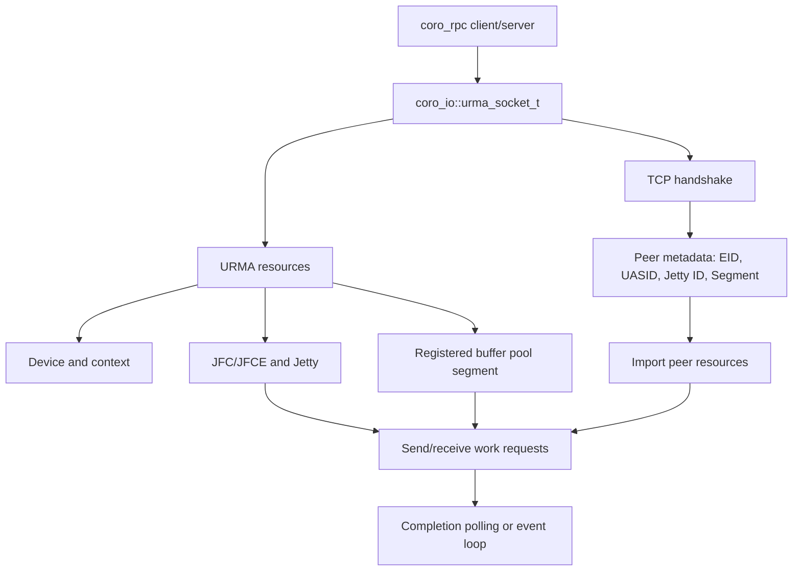

# URMA RPC

本文介绍 `coro_rpc` 的 URMA 传输层、自动升级机制、配置方式和底层接口。URMA 是可选功能；未启用或初始化失败时，`coro_rpc` 继续使用 TCP。

## 1. 架构与连接流程

URMA RPC 由三层组成：

1. `coro_rpc`：负责 RPC 编解码、handler、连接管理和 attachment。
2. `coro_io::urma_socket_t`：负责 TCP 握手、URMA Jetty 建链、收发队列和完成事件。
3. URMA 资源层：负责设备、context、JFC/JFCE、Jetty、Segment 和 work request。

连接建立先使用 TCP 交换 EID、UASID、Jetty ID 和 buffer pool segment；随后双方导入对端资源，数据面切换到 URMA。TCP 只用于握手。



buffer pool 将一块连续内存注册为 Segment，再切分为固定大小的 buffer，减少重复注册开销。发送窗口受本地发送 buffer 数和对端接收 buffer 数共同限制。

## 2. 构建与显式启用

```bash
cmake -S . -B build -DYLT_ENABLE_URMA=ON -DBUILD_EXAMPLES=ON
cmake --build build --target coro_rpc_urma_example -j
```

CMake 从 `URMA_ROOT`、`/usr/include` 和 `/usr/local/include` 查找 UMDK
头文件，支持 `urma/`、`umdk/urma/` 和 UMDK 源码目录布局。例如：

```bash
cmake -S . -B build -DYLT_ENABLE_URMA=ON \
  -DURMA_ROOT=/opt/umdk
```

也可以通过环境变量指定：

```bash
export URMA_ROOT=/opt/umdk
```

配置必须同时包含 `urma_api.h` 和 bonding 扩展头 `urma_ubagg.h`，并在启用
URMA 时链接系统 `liburma`。

```cpp
coro_rpc_server server(std::thread::hardware_concurrency(), 9000);
server.init_urma();
server.register_handler<echo>();
server.start();
```

```cpp
coro_rpc_client client;
if (!client.init_urma()) {
  co_return;
}
auto ec = co_await client.connect("127.0.0.1:9000");
auto result = co_await client.call_for<echo>(30s, "hello urma");
```

## 3. 配置

```cpp
coro_io::urma_socket_t::config_t config{
    .cq_size = 128,
    .recv_buffer_cnt = 64,
    .send_buffer_cnt = 64,
    .buffer_size = 4096,
    .max_memory_usage = 256ull * 1024 * 1024,
    .device_name = "bonding_dev_0",
    .eid_index = 0,
    .tp_type = URMA_CTP,
};

server.init_urma(config);
client.init_urma(config);
```

## 4. 环境变量自动升级

默认 TCP 配置下，设置 `URMA_RPC_ENABLE=1` 可自动探测 URMA 设备并升级：

```bash
export URMA_RPC_ENABLE=1
export URMA_RPC_DEVICE=bonding_dev_0
export URMA_RPC_EID_INDEX=0
```

`URMA_RPC_ENABLE` 接受 `1`、`on`、`true`、`yes`。未设置、关闭或设备探测失败时回退 TCP。显式调用 `init_urma(config)` 的配置优先。

| 变量 | 作用 |
| --- | --- |
| `URMA_RPC_ENABLE` | 启用自动升级 |
| `URMA_RPC_DEVICE` | 设备名；为空时自动选择 |
| `URMA_RPC_EID_INDEX` | EID 下标，默认 `0` |
| `URMA_RPC_CQ_SIZE` | completion queue 大小 |
| `URMA_RPC_RECV_BUFFER_CNT` / `URMA_RPC_SEND_BUFFER_CNT` | 收发 buffer 数 |
| `URMA_RPC_BUFFER_SIZE` | 单个 buffer 大小 |
| `URMA_RPC_MAX_MEMORY_USAGE` | buffer pool 上限，单位 byte |
| `URMA_RPC_TP_TYPE` | `ctp`、`rtp` 或其他支持的类型 |
| `URMA_RPC_PRIORITY` | JFS priority，范围 `0~15`，默认值为 `15` |
| `URMA_RPC_EVENT_MODE` | JFCE 事件模式开关 |
| `URMA_RPC_BUSY_POLL_BUDGET` | 事件唤醒后的忙轮询次数 |
| `URMA_RPC_POLL_INTERVAL` | 轮询间隔，单位微秒 |

实现位于 `include/ylt/coro_io/urma/urma_rpc_env.hpp`，行为测试位于 `src/coro_rpc/tests/test_urma_rpc_env.cpp`。

## 5. URMA 接口

| 层次 | 主要接口 | 作用 |
| --- | --- | --- |
| 生命周期 | `urma_init`、`urma_uninit` | 初始化和释放 runtime |
| 设备 | `urma_get_device_list`、`urma_get_eid_list`、`urma_query_device` | 查询设备、EID 和能力 |
| Context | `urma_create_context`、`urma_delete_context` | 创建设备上下文 |
| 完成队列 | `urma_create_jfc`、`urma_create_jfce`、`urma_poll_jfc`、`urma_wait_jfc` | 等待并读取完成记录 |
| 数据队列 | `urma_create_jfs`、`urma_create_jfr`、`urma_create_jetty` | 创建收发资源 |
| 远端资源 | `urma_import_seg`、`urma_import_jetty` | 导入对端 Segment 和 Jetty |
| 本地内存 | `urma_register_seg` | 注册 URMA 可访问内存 |
| 数据收发 | `urma_post_jetty_send_wr`、`urma_post_jetty_recv_wr` | 提交 work request |

典型顺序是：创建 context → 创建 JFC/JFCE 和 Jetty → 注册 Segment → 交换元数据 → 导入对端资源 → post WR → poll/wait completion → 释放资源。声明来自外部 UMDK 的 `urma_api.h` 和 `urma_types.h`。

## 6. 大数据与压测

大 payload 建议使用 attachment：

```cpp
client.set_req_attachment(payload);
auto result = co_await client.call_for<upload>(30s, payload.size());
```

```bash
cmake --build build --target coro_rpc_urma_benchmark -j
```

详细参数见 [`urma_benchmark/README.md`](../src/coro_rpc/examples/urma_benchmark/README.md)。`--transport raw` 用于排除 RPC 编解码开销，`--rpc attach_sink` 用于测试 attachment 快路径。

## 7. 排障

- 没有 URMA 目标：确认使用 `-DYLT_ENABLE_URMA=ON`，并安装匹配的库、头文件和驱动。
- 自动升级未生效：确认 `URMA_RPC_ENABLE` 有效，且应用走默认 TCP 配置路径。
- 初始化或连接失败：检查设备名、EID、TP 类型和 TCP 握手端口。
- 高并发下出现 RNR 或 `WR_FLUSH_ERR`：降低连接数、pipeline depth、队列深度，或增加内存上限。
- 定位延迟：启用 benchmark 的 `--profile`，观察握手、post send、completion wait、RPC dispatch 和 attachment 阶段。

示例：`src/coro_rpc/examples/urma_example/urma_example.cpp`；实现：`include/ylt/coro_io/urma/`；公共 API 来自 UMDK 的 `urma_api.h`、`urma_types.h` 和 `urma_ubagg.h`。
